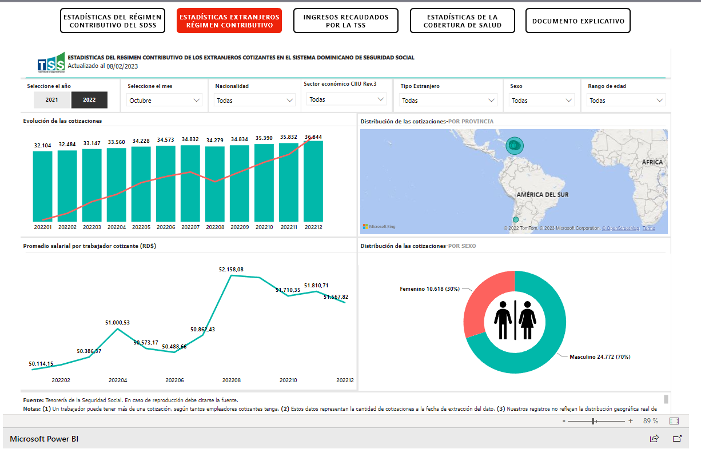
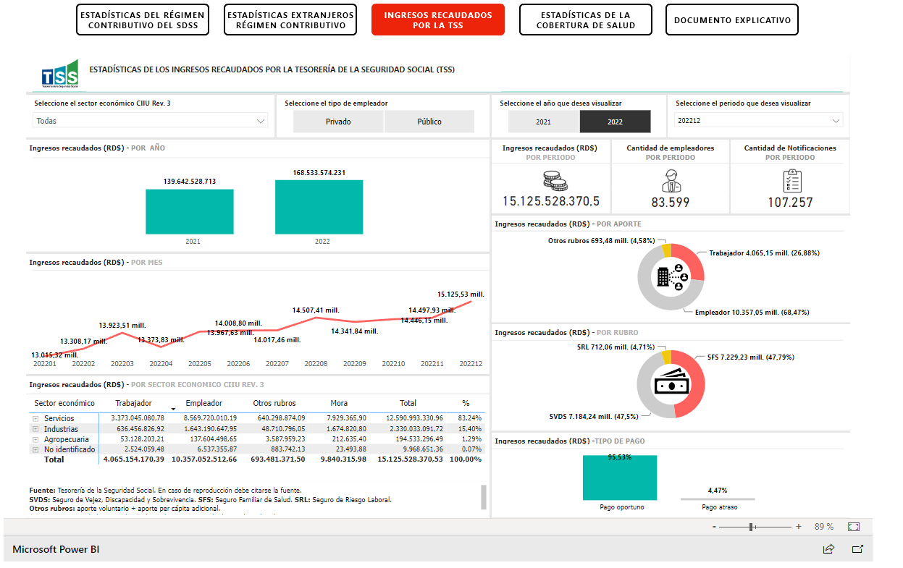
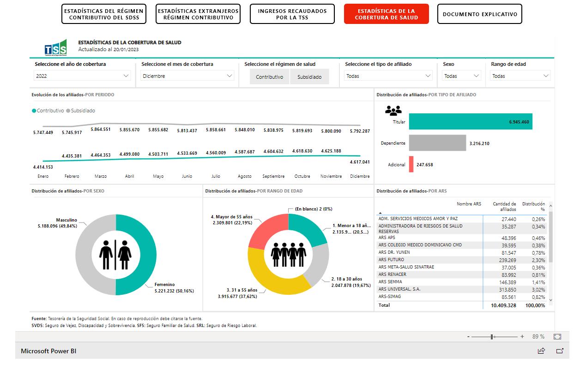
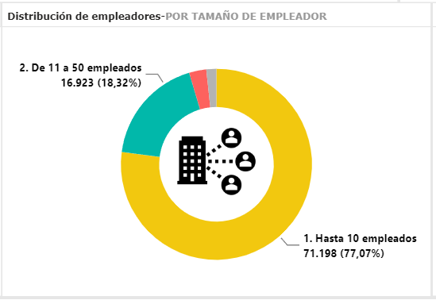

# Proyecto \# 2 - Empleados Públicos vs. Empleados Privados

Tenía en plan hacer un proyecto en el cual hacía mi propio tablero/gráficos sobre este tema pero he descubierto que la TSS tiene un tablero en PowerBI y he decido poner en prueba mi experiencia para ver que cosas puedo ver basado en el trabajo de otros.

Como siempre he estado del otro lado (desarrollando tableros) quizás pudiera poner en test mi habilidad para ver que cosas pudiera yo hacer mejor o que cosas pudiera encontrar a partir de lo que los demás me suplen a mi.

Esto no es más que un ejercicio mental y no un proyecto per se, pero así cambio mi panorama. Lo haré en markdown para ir tambien acostumbrarme más a Markdown y las cosas divertidas que puedo hacer aquí.

¡Vamos a esto!

```{r setup, include=FALSE}
knitr::opts_chunk$set(echo = TRUE)
```

## Tablero Interactivo TSS

En primera instancia, el tablero se encuentra en el siguiente enlace: [Tablero interactivo](https://tss.gob.do/tableros-interactivos.html). Tiene varías informaciones, una buena [documentación](https://tss.gob.do/assets/deel21122022.pdf), y muchas notas. Esta parte me gusta mucho así no deja nada al azar y más tratandose de información guvernamental.

Es agradable a la vista realmente, algunas cositas que personalmente agregaría; no todo el mundo está familiarizado con la tecnología en general ni PowerBI así que una nota a la [versión pantalla completa](https://app.powerbi.com/view?r=eyJrIjoiMWEyZGMyZmYtNWI5Yy00MjE1LWIxZWEtNDYzN2JlNzkyZmUxIiwidCI6IjY1OGYzMWY0LTg5YjEtNDJlMC1iYWNlLWYzMTkwNDBkZmRmOSIsImMiOjF9) estaría chulo (Sí, sé que la opción está en la esquina pero sabemos como son las cosas).

### Los reportes:


Sé que PowerBI limita mucho los espacios por como funciona la paginación, pero ese loguito y yo no somos muy amigos. Otro punto son los formatos, los datos tienen formato Europeo, puntos en los miles y coma en los decimales, digamos que esa no es la norma aquí en República Dominicana. Aunque en la defensa de quien sea que desarrollo eso, aquí no hay ninguna normativa clara, más no puedo negar que el contexto es importante.

La mayoría de personas aquí se les enseña el formato punto (.) para decimales y comas (,) para miles. En la gráfica de línea (Ovija si no me confundo de nombre que se usa en español) no soy fanatico de usar 202201, preferíria usar el 2022-01. Si sé que PowerBI no organiza bien eso pero para eso creas una columna de organización y problema resuelto.

Hubiera usado otros colores para los gráficos que no fuese el default, porque ese color lo conozco. Me uso el default jeje.

El gráfico de "Evolución de las cotizaciones" da poca información visualmente, la verdad es que si borraras los números tuviera 0 información de valor. Quizás jugar con el eje y para que se pueda ver mejor como evolucionan, o quizás agregar un eje secundario que tuviera el Porcentaje de crecimiento vs el periodo anterior o año anterior. Se puede dar más información en un solo gráfico.

Distribución de la cotizaciones, bueno, al menos deja que se puedan ver los grupos.. o darle menos espacio a las barras o cambiar a algo como:

-   \<RD\$5,000

-   RD\$5,000-RD\$10,000

No puedo asumir que todo el mundo entienda el \< pero por el contexto se pudiera entender.

Los filtros muy bien me parecen, lo único que los meses no afectan los historicos y bueno me pone a pensar que si dejarlo al usuario entenderlo por su cuenta está bien.


De plano, el mapa no da nada de información. Si, Santo Domingo tiene la mayor concentración de cotizaciones, quizás seguido por Santiago (Sorpresa?). Creo que lo único que hace es consumir espacio, quizás una tabla comparativa con % de contribución y contribución total hubiera sido mejor.

Otro tema es que el color de los anillos en el pastel tenemos que la categoria 2 y 4 son basicamente el mismo color y no se identifican a simple vista.

Algo que me sorprendió fue ver que nuestra cotización pública no es tan alta como pensaba, no voy a mentir. La hacía más cerca de unos 50%, aunque hay algo a considerar y es que la mayoría de los empleados públicos tienen muchos bonos por fuera del salario y estos no se registran aquí. Aparte de los que cobran por fuera... pero eso son otros temas.

Y por último:


Esta tiene lo mismos puntos de la anterior, en mi opinión una tabla como la de la derecha abajo es la que se tenía que usar para los mapas.

Y quien sabe si esa misma tabla hubiera hecho más sentido en los mapas pero usando los % en vez de los gruesos, quizás hubieramos visto cosas como:

-   En Santo Domingo las Industrias tienen mas alta distribución

-   En Elias Piña rompe la norma y en segundo lugar en la mayoría de empleadores son Hoteles, Bares y Restaurantes (En casi todas las otras provincias son Otros Servicios, el cual ni siquiera existe en Elías Piña)

    -   Ese punto me lleva a la pregunta, por qué hay tantos empleadores/cotizantes en una categoría que es "Otros Servicios", que tan especificos son que no pueden tener una categoría? Están desactualizados en la TSS con las categorias?

No es que estas informaciones no se pueden obtener pero para llegar a ellas hay que jugar mucho con los filtros y no todo el mundo es tan hábil, al final, si queremos ganarnos a los inversionistas y a los dirigentes públicos tenemos que asegurarnos que puedan encontrar insights rápidos.

Hay más reportes pero por lo menos para esta parte no iré sobre todos los detalles.

#### Reporte #2



-   San Juan está en Chile, situación que no me parece bien.

-   Los ejes en la ovija están discontinuos (porque no los marco como categoricos en las opciones).

-   Aquí si aplico lo de la línea pero no sabemos que significa porque no tiene ni valores ni información en el título.

#### Reporte \# 3



-   Muchos números en las líneas, no se colocan bien, debe de cambiar formato para mejor comprensión

-   Graficos de barras con 2 categorías, mucho espacio poca información.

#### Reporte \# 4 {#4}



Sólo diré que no soy fánatico de que Senasa subsidiado represente 55% aquí jeje.

## Los Insights

Mientras veia el reporte numero 1 (el cual tiene más información que los demás he encontrado algunas cosas que el reporte nos deja ver).

1.  Sobre el ratio de cotizaciones y empleadores:

Por desgracia no tenemos la cantidad promedio de cotizaciones por cotizante por lo cual voy a asumir que los hombres tienen 1.3 cotizaciones (un alto ratio tiene mas de un trabajo) y una sola cotización por mujer. Nos deja con:

```{r}
1244428/1.2
```

1,037,023 cotizantes hombres para el mes de Diciembre y 1,083,439 mujeres. Lo cual no me parece descabellado viendo como es la distribución de ratio en la mayoría de las empresas.

Si vemos de la segunda página del primer reporte podemos extraer la siguiente tabla:

| Tamaño Empleador      | Cantidad de Cotizaciones | Distribución(%) |
|-----------------------|:------------------------:|:---------------:|
| Hasta 10 empleados    |         265,084          |      11.3%      |
| De 11 a 50 empleados  |         362,339          |      15.5%      |
| De 51 a 150 empleados |         224,258          |      9.6%       |
| Más de 150 empleados  |        1,485,264         |      63.6%      |

: Cantidad y distribución de cotizaciones por Tamaño de empleador

Esta es la información que está en el Pie chart en una tabla, al verla me pregunto si esta es la distribución correcta? O será porque la ley las cataloga así? Ya sabrán en la TSS si es así, pero no me gusta la estructuración de las clases, aunque adelante se ve porque están así.

Recuerdan más arriba donde dije que me parecía extraño la percepción que tenía de los empleados públicos, al verlo a nivel actividad ecónomica, la administración pública tiene la mayor cantidad de cotizaciones con 661,77 que representan un 28.3% por actividad economica.

Ahora algo interesante que se puede ver juntando la tabla de arriba y este gráfiquito



Dejame primero agregar la tabla porque este también tiene deficiencias presentando los datos:

| Tamaño Empleador      | Cantidad de Empleadores | Distribución(%) |
|-----------------------|:-----------------------:|:---------------:|
| Hasta 10 empleados    |         71,198          |      71.2%      |
| De 11 a 50 empleados  |         16,923          |      18.3%      |
| De 51 a 150 empleados |          2,685          |      2.9%       |
| Más de 150 empleados  |          1,576          |      1.7%       |

*Lo vieron?* La distribución se ha volteado totalmente, **tenemos más de 90,000 MyPimes** no obstante este no es un sector de alta importancia en nuestro país. No importa como lo pintes es increible.

1,576 empleadores tienen 1,485,264 de las cotizaciones. Esto es:

```{r}
1485264/1576
```

Un promedio de 900 cotizaciones por cada empleador en ese grupo.

Ahora en ese número hay un sesgo y es el sector público así que vamos a sacar eso rápidamente:

```{r}
780427/1306
```

Tenemos un promedio de 600 aproximadamente por empresas privadas de mas de 150 empleados. Por esto mismo considero que estas categorias necesitan ser actualizadas.

Lo que es más loco es que casualmente he eliminado esto:

-   El fisco tiene 704,837 cotizaciones con 270 empleadores de más de 150 empleados. Que se calcula a:

```{r}
704837/270
```

**2610 Cotizaciones por empleador.** Y aquí es donde no me parece para nada loco la idea de que hay demasiadas personas en el fisco. De repente ese 31% no se ve tan lindo...(En el Distrito Nacional el fisco representa en 46.2% por cierto).

Entiendo que el gobierno tenga ciertos ministerios como por ejemplo Eduación y haya empleados por todos lados pero son demasiadas cotizaciones y más cuando el promedio del Salario es RD\$42,577. Hay muchas cosas que no me cuadran de estos números y me dan más preguntas que respuestas.

Pero vamos a buscar fun facts y dejemos la investigación gubernamental para otro día:

1.  El sub sector economico (Privado) con salario promedio mas alto es Explotación de Minas y Canteras, en segundo lugar Intermediación Financiera, Seguros y Otras, seguida por la Administración Pública.

2.  El comercio tiene casi todos los empleados, luego Otros Servicios y luego Manufactura.

3.  Los jovenes trabajan (18 a 30) mas en Comercio (18.6%) \> Adm. Publica \> Manufactura.

4.  Mayor a 55 años tienen un 45% en Administración Pública (Mal, muy mal). Lo mismo aplica para 31 a 55 años con un 30%

5.  La cantidad de empleadores a cambiado de tener 76,852 en Enero 2021 a cerrar el 2022 con 89,742.

```{r}
scales::percent(89742/76852-1)
```

Ha crecido un 17% not bad.

Fuentes:

<https://tss.gob.do/tableros-interactivos.html>

<https://app.powerbi.com/view?r=eyJrIjoiMWEyZGMyZmYtNWI5Yy00MjE1LWIxZWEtNDYzN2JlNzkyZmUxIiwidCI6IjY1OGYzMWY0LTg5YjEtNDJlMC1iYWNlLWYzMTkwNDBkZmRmOSIsImMiOjF9>
